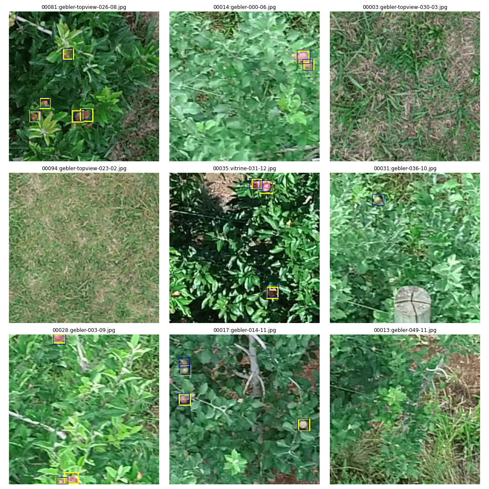

# Training Faster R-CNN on ADD256 (Embrapa Apples by Drones Detection Dataset)

This code is a supplementary material for the paper [*A methodology for detection and localization of fruits in apples orchards from aerial images *](https://sol.sbc.org.br/index.php/sbiagro/article/view/18369)
by Santos & Gebler (2021), presented at [SBIAgro 2021](https://eventos.unipampa.edu.br/sbiagro/) (the XIII Congresso Brasileiro de Agroinformática). 
This work presents a methodology for automated fruit counting employing aerial-images, including
algorithms based on multiple view geometry to perform fruits tracking.

The present code details just the _apple's detection part_, as presented on Section 2.1.1 in the paper. 
We have employed a **Faster R-CNN network** with a **ResNet-50 backbone**, using tochvision 0.10.0 (model),
PyTorch Lightning (training) and Albumentations (augmentations). Check [the ADD256 repo](https://github.com/thsant/add256) 
for the data.

